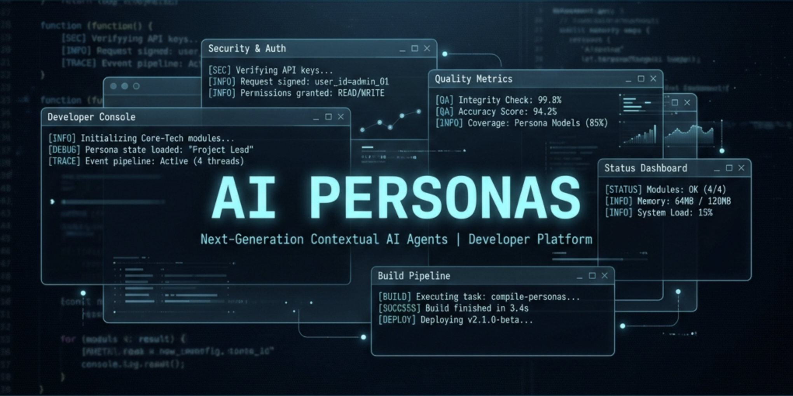
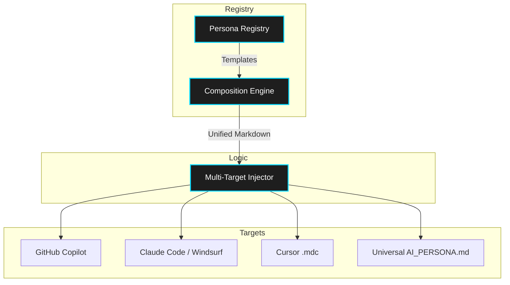

<div align="center">
  

  # AI-Personas
  
  [](https://www.npmjs.com/package/ai-personas)
  [](https://github.com/aashishkandel/ai-personas/actions)
  [](LICENSE)
  [](package.json)

  **Inject domain-specific expertise into your favorite AI coding assistants.**
</div>

---

### **Overview**

**AI-Personas** is a zero-overhead, workflow-embedded context system designed to bridge the "Senior Context Gap" in generic AI models. It ships with deeply-structured persona packages—including checklists, anti-patterns, and decision trees—so your AI assistant thinks like a specialized expert, not just a general-purpose autocomplete.

Whether you use **GitHub Copilot**, **Claude Code**, **Windsurf**, or **Cursor**, AI-Personas surgical-injects the metadata needed for your AI to adhere to top-tier engineering standards natively.

---

## Why?

Generic AI coding assistants (Copilot, Cursor, Windsurf, Claude Code) lack domain-specific context. They write code that "works" but misses:
- **Code review criteria** specific to your team's standards
- **Security checklists** like OWASP Top 10 validation
- **Compliance requirements** like HIPAA or PCI-DSS
- **Performance budgets** for real-time or financial systems
- **Anti-patterns** that experienced engineers catch immediately

**AI-Personas** solves this by installing deeply-structured persona files that your AI reads natively — no orchestrator, no custom commands, no overhead.

---

### **How it Works**

AI-Personas uses a surgical injection system that understands the specific rule formats of leading AI tools.




---

## Quick Start 🚀

No global installation or bloat required. Just use `npx` directly in any repository:

```bash
# Install specific personas
npx ai-personas install developer architect qa

# Install all personas
npx ai-personas install --all

# See what's available
npx ai-personas list

# Preview a persona before installing
npx ai-personas info security

# Check what's installed
npx ai-personas status

# Remove a specific persona
npx ai-personas remove developer

# Remove all
npx ai-personas remove --all
```

**What to do next?**
Once installed, just open GitHub Copilot Chat, open Windsurf, or run `claude` in your terminal. They will automatically detect and ingest the newly injected persona files without any extra configuration!

---

## Available Personas 🎭

### **Core Roles** 🧩

| Role | Badge | Logic Focus | Key Expert Guidance |
|:---|:---:|:---|:---|
| `developer` | 💻 | Clean Code | SOLID principles, DRY, performant ESM, unit testing |
| `architect` | 🏛️ | Scalability | System design, ADRs, trade-off analysis, patterns |
| `qa` | 🧪 | Reliability | Test strategies, edge cases, validation, reliability |
| `designer` | 🎨 | UX/UI | Accessibility (WCAG), responsive design, component APIs |
| `devops` | 🚀 | CI/CD | Infrastructure-as-code, monitoring, incident response |
| `security` | 🔒 | Protection | OWASP Top 10, auth, input validation, auditing |

### **Domain Verticals** 🏢

| Industry | Persona | Logic Focus | Key Expert Guidance |
|:---|:---|:---|:---|
| **Finance** | `fintech` | Accuracy | Precision arithmetic, audit trails, PCI-DSS, AML/KYC |
| **Health** | `healthtech` | Privacy | HIPAA compliance, PHI protection, consent management |
| **Gaming** | `gamedev` | Loops | ECS patterns, frame budgets, asset pipelines |

---

## What Gets Installed 📦

Each persona is more than a simple markdown file. It's a **structured context package** containing:

| Section | Purpose |
|---------|---------|
| **Persona** | Identity, core principles, decision framework, code review lens |
| **Workflows** | Decision trees, process flows, templates (e.g., ADR template, bug fix protocol) |
| **Checklists** | Quality gates for pre-commit, pre-PR, pre-deploy |
| **Anti-Patterns** | Common mistakes this persona specifically catches |

### Where Files Go

| Tool | Target Path | Rule Format |
|:---|:---|:---|
| **GitHub Copilot** | `.github/copilot-instructions.md` | Single file (Multi-Persona Merging) |
| **Claude Code** | `.claude/rules/persona-*.md` | Multi-file (Native `paths:` scoping) |
| **Windsurf** | `.windsurf/rules/persona-*.md` | Multi-file deployment |
| **Cursor** | `.cursor/rules/persona-*.mdc` | **High-performance `.mdc` format** |
| **Antigravity** | `.agents/rules/persona-*.md` | Agent-native rule configuration |
| **Universal** | `AI_PERSONA.md` | Fallback for any AI tool |

---

## Multi-Persona Stacking & Intelligence 🧠

Install multiple personas and they're **simultaneously active** — your AI thinks from all perspectives at once:

```diff
$ npx ai-personas install developer security fintech

+   ✓ Loaded 3 personas: developer, security, fintech
  
!   ℹ Composition Note:
!     developer and security share focus areas (code-quality). 
!     Both perspectives will be active for comprehensive coverage.

  Injecting into GitHub Copilot...
+     ✓ .github/copilot-instructions.md (appended)

  Injecting into Claude Code...
+     ✓ persona-developer.md (created)
+     ✓ persona-security.md (created)
+     ✓ persona-fintech.md (created)
+     ✓ _persona-manifest.md (created)

+   ✓ Done! 3 personas → 14 files injected.
  Your AI assistant now thinks as Developer + Security + Fintech.
```

This stack makes the AI:
- Write clean, well-tested code (developer)
- Check for OWASP vulnerabilities (security)
- Use integer arithmetic for money and enforce audit trails (fintech)

---

## Claude Code File Scoping 📂

For Claude Code, **AI-Personas** uses native `paths:` frontmatter to **activate personas only for relevant files**:

```markdown
---
paths:
  - "**/*.ts"
  - "**/*.tsx"
  - "**/*.js"
---
# Developer Persona
[...]
```

This ensures the `developer` persona activates when editing code files, but remains quiet when you are just modifying markdown documentation or generic config files.

---

## Idempotent & Surgical 🔪

- **Idempotent installs** — Running `install` twice doesn't create duplicate content blocks.
- **Surgical removal** — Running `remove developer` scrubs only the developer persona markers across all configured targets without disrupting customized modifications you made independently.
- **Marker-based Tracking** — Uses clean HTML comments (`<!-- AI-PERSONAS:name:START -->`) natively hidden in Markdown previews.

---

### **Commands Reference** 💻

| Command | Args | Description |
|:---|:---|:---|
| `install` | `[personas...]` | Install one or more experts into the current project |
| `list` | | List all available personas with detailed tags |
| `info` | `<persona>` | Preview a persona's full guide in the terminal |
| `status` | | Show active personas and detected target paths |
| `remove` | `[personas...]` | Surgical remove personas from all configured paths |

---

### **Requirements**

- **Node.js** 22.0.0+ 
- **npm** 7.0.0+

---

### **Community & Support**

- **Bugs & Features**: [GitHub Issues](https://github.com/aashishkandel/ai-personas/issues)
- **Author**: [Aashish Kandel](https://github.com/aashishkandel)
- **License**: [MIT](LICENSE)

<div align="center">
  <br />
  Built with ❤️ for the AI Engineering community.
</div>
